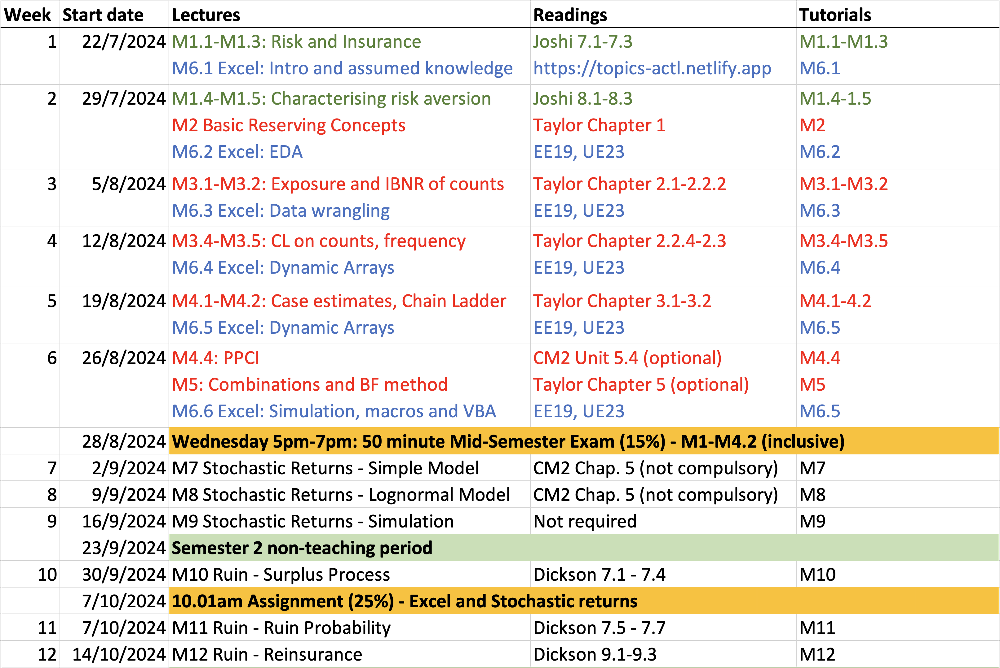
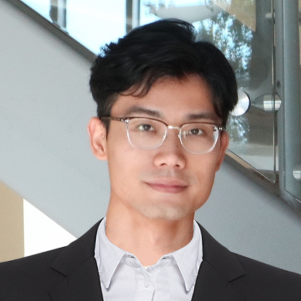

<!-- 
 If you wish to watch the embedded videos from Lecture Capture, you need to have logged in and <a href="https://canvas.lms.unimelb.edu.au/courses/107520/external_tools/701">entered Lecture Capture</a> via Canvas once for each session. This is to restrict access to students enrolled at the University of Melbourne only. Access to some files requires you to be logged in as well. 
 -->

**
Welcome to the 2024 edition of Topics in Actuarial Studies / Topics in Insurance and Finance!
**

The overall aim of this website is to provide access to the teaching materials relevant to:


 
 **Utility theory, Reserving, and Spreadsheets** 

as per items 1.2 "Rational choice theory" (introduction), 5.2 "Liability valuations / Run-off triangles", and Excel modelling requirements (relevant to the all syllabus items) for exam CM2B of the [CM2 syllabus](https://www.actuaries.org.uk/documents/cm2-syllabus-2023); see also the [course mappings](docs/0-subject-guide/SILO)

This component will be taught by Benjamin Avanzi.

<--->

 **Stochastic investment returns and Ruin theory** 

as per items 3 "Stochastic interest rate of return models" and 5.1 "Liability valuations / Ruin theory" and  of the [CM2 syllabus](https://www.actuaries.org.uk/documents/cm2-syllabus-2023); see also the [course mappings](docs/0-subject-guide/SILO)

This component will be taught by Yuyu Chen.



<!-- This is code to show an image called 'schedule.png' -->

Some links in this website are only available to students enrolled in the relevant subjects at the University of Melbourne, and so is the information about subjects. Please post any question on the Ed discussion forum (see link in the left navigation bar).

We look forward to guiding your learning in this subject! 


 

Professor Benjamin Avanzi 

<--->

 
Dr Yuyu Chen



