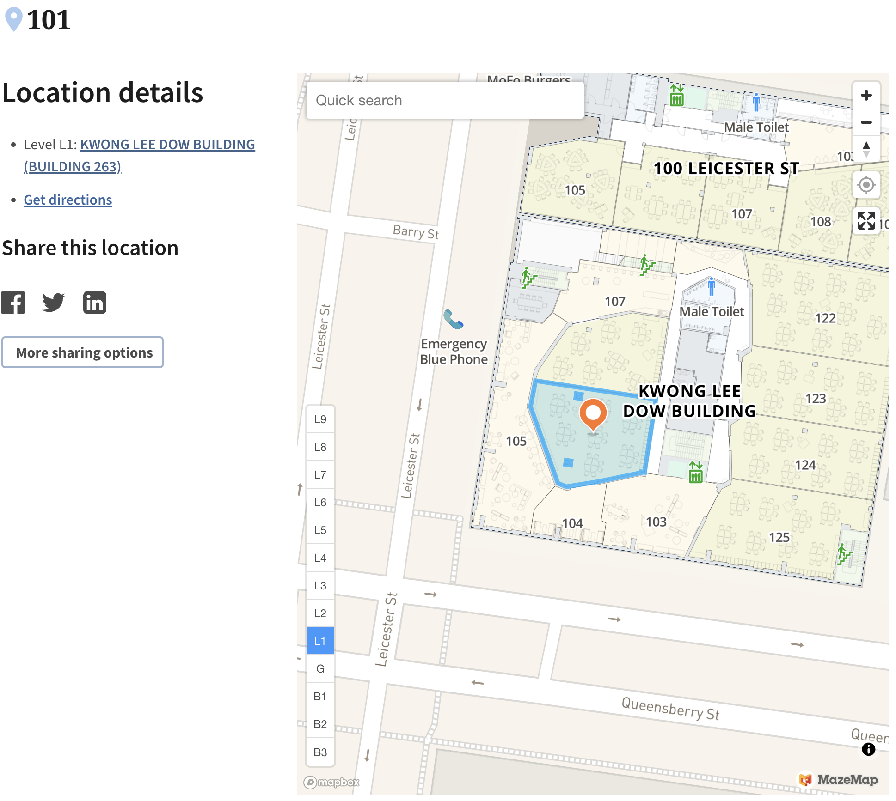

# Assessment Overview

## Assessment structure

Your assessment for this subject comprises the following:

1. [a 50 minute closed book mid-semester exam](Assessment/#mid-semester-exam) (15%)
1. [an individual assignment](Assessment/#individual-assignment) (25%)
1. [a 2 hour closed book final exam](Assessment/#final-exam) (60%)

Hurdle requirement: To pass this subject students must pass the end of semester examination.

In the following sections, details are provided (and will be populated throughout semester) about those assessments.

<!-- ## Penalties for Late Submission and Exceeding Word Limits -->

<!-- In order to ensure equality for all students, assignments and examinations (where relevant) must be submitted by specified deadlines. Late submissions will attract the following marking penalties (unless approval for late submission has been granted): -->

<!-- **All assignments (excluding examinations):** 10% penalty per day *of the total maximum mark for the piece of assessment*. -->

<!-- Assignments that exceed word limits may also attract a marking penalty in line with University policy. Students with a genuine and acceptable reason for not completing an assignment (or other assessment task), such as illness, can apply for special consideration (see Policies below). -->

<!-- **Examinations:** -->

<!-- Canvas Quiz will automatically submit the exam when the time limit (comprised of reading time & writing time) has been reached (for example, after 60 minutes for an exam with 30 minutes of writing time and 30 minutes of reading time). Students must click ‘submit’ at the completion time if they did not start the exam at the scheduled commencement time to not incur any late penalty. -->

<!-- For example, a 60-minute exam scheduled at 3:00pm, but commenced at 3:15pm, will automatically submit at 4:15pm and the student will incur a late penalty. Students must click 'submit' at 4:00pm to not incur a late penalty. Students who are prevented from submitting on time or at all due to technical difficulties will need to apply for technical consideration with supporting documentation. -->

# Mid-semester exam

## Date

The mid-semester exam will take place online on  **Monday 28 August 2023 between 2.30pm and 3.30pm**. Please ***arrive by 2.15pm at the latest***. The exam won't start before 2.30pm, but it may start later, so please make sure you are available until 4pm.

## Type

The mid-semester exam will be a "traditional", closed book, pen on paper exam.

**You will be allowed to bring one A4 sheet of notes, double sided. You can write as much as you want on that one sheet of paper (text and/or formulas), on both sides, but it cannot be more than one A4 sheet.**

**You will be allowed to bring a Casio FX-82 (with or without suffix) calculator.**

## Venue

[`PAR-Kwong Lee Dow-101and102 `](https://maps.unimelb.edu.au/point?poi=659376)

## Duration

<!-- Important online mid-semester examination information: This mid-semester examination is the equivalent of a 50-minute assessment; however, students are provided with 75-minutes to accommodate the time that will be required for typesetting of mathematical expressions, loading, processing and modelling of data with the statistical software R, and the uploading of documents / answers. -->

50 minutes sharp, plus 5 minutes reading time. You are not allowed to write during reading time.

## Scope

The mid-semester exam will assess contents from Modules 1 to 4 (lectures of weeks 1-4) and associated tutorial exercises, readings, spreadsheets, and course contents. This focuses on the risk and insurance, as well as all of reserving components of the subject.

## Practice

<!-- There will be two quizzes on Canvas to help you practice: -->

<!-- - [`Practice Quiz`](https://canvas.lms.unimelb.edu.au/courses/107520/assignments/249478) is a very simple 3 question quiz that allows you to see what the three types of questions look like (multiple choice, multiple answer, essay) -->
<!-- - [`2020 Mid-semester Exam`](https://canvas.lms.unimelb.edu.au/courses/107520/assignments/249479) is the MSE from last year for you to practice and get feedback about your preparation. -->

The exam will be of the "traditional" type, in line if the IFoA CM2A exams; see [`below`](Assessment#past-cm2-exams) for details.

## Additional details

See [`General Advice`](/Assessment/#general-advice) for further details.

# Individual assignment

## Assignment instructions

The assignment will be an assignment which will need to be performed in Excel, which will be specifically assessed.

The assignment will assess skills from Reserving and Stochastic returns (TBC) and associated tutorial exercises, readings, spreadsheets, and course contents. Communication skills will also be assessed.

Additional details and instructions will be available later (around mid-semester exam time).

<!-- All assignment instructions and details are available in this document: [`assignment instructions`](https://canvas.lms.unimelb.edu.au/courses/145406/modules/items/3754224) -->

##  Assignment submission

Assignment submission is via the LMS Assignment Submission link for all written assignments. Please refer to the [Turnitin section of the LMS website via for detailed submission instructions if needed](http://go.unimelb.edu.au/zax6).

Please note that you are required to keep a copy of your assignment after it has been submitted as you must be able to produce a copy of your assignment at the request of teaching staff at any time after the submission due date.

<!-- Refer to the [`assignment instructions`](https://canvas.lms.unimelb.edu.au/courses/107520/modules/items/3200544) for additional details and requirements about its submission. -->

## Penalties for Late Submission

In order to ensure equality for all students, assignments and examinations (where relevant) must be submitted by specified deadlines. Late assignments, where approval for late submission has not been given, will be penalised at the rate of 20% of the total mark per day, for up to 5 days, at which time a mark of zero will be given.

Students with a genuine and acceptable reason for not completing an assignment (or other assessment task), such as illness, can apply for special consideration. Special Consideration assists students who have been significantly affected by illness or other serious circumstances during the semester. The following website contains detailed information relating to who can apply for Special Consideration and the process for making an application:
http://students.unimelb.edu.au/admin/special

# Final exam

## Type

The final exam will be a “traditional”, closed book, pen on paper exam.

**You will be allowed to bring one A4 sheet of notes, double sided. You can write as much as you want on that one sheet of paper (text and/or formulas), on both sides, but it cannot be more than one A4 sheet.**

**You will be allowed to bring a Casio FX-82 (with or without suffix) calculator.**

Additional instructions for the exam are on the cover sheets ([UG](https://canvas.lms.unimelb.edu.au/courses/153686/modules/items/5212151)/[PG](https://canvas.lms.unimelb.edu.au/courses/154246/modules/items/5212152))

## Date

The date of the final exam is published on the [``University of Melbourne Exams Timetable website``](https://my.unimelb.edu.au/).

## Duration

2 hours, plus 15 minutes of reading time.

## Scope

The final exam will assess **all** contents of the course, with particular focus on the materials taught beyond week 6. The questions will focus particlarly on:

- Modules 1 and 5 (and associated knowledge which may come from Modules 2-4)
- Modules 7 to 12

The material from the following slides from Modules 7 to 12 is not required for the final exam:

- Module 7: p. 54-56
- Module 9: p. 10, p. 23, and anything directly related to Excel, e.g., how to implement a procedure in Excel  (however, you may need to understand the procedure, i.e., know the theoretical basis). 
- Module 10: p. 25 and p. 27
- Module 11: p. 23-28
- Module 12: p. 9-11

Examinable materials include associated tutorial questions (it is important that you understand the details of the examples /questions in these materials and that you are able to replicate the solutions independently and efficiently), associated mandatory readings, as well as the assignment task and the mid-semester exam.

## Marks and allocation to topics

Will be available later.

<!-- The final exam is double in size as compared to the mid-semester exam. As such, it will carry 36 marks over 24 questions. Here are more detailed breakdowns: -->

<!-- - 18 marks for actuarial practice, 18 marks for actuarial techniques -->
<!-- - 9 questions are open questions, counting for 18 marks -->
<!-- - Marks per week: -->
<!--   - 2 marks: week 1, 5, 6, 7, 11 -->
<!--   - 3 marks: week 2, 4, 8, 9 -->
<!--   - 4 marks: week 3, 12 -->
<!--   - 6 marks: week 10 -->

<!-- The software R was used to automate the generation of questions. Even without counting the shuffling of answers, there are one million billion  ( `\(10^5\)` ) possible exams. **Collusion is of course illegal, but it is also pointless.** -->

<!-- ## Practice -->

<!-- A selection of questions from the 2020 Edition of ACTL10001 Introduction to Actuarial Studies (questions about topics not covered in 2021 were removed) is [``available on Canvas``](https://canvas.lms.unimelb.edu.au/courses/107520/assignments/257862). The multiple answer and multiple choice questions automatically mark themselves. The open questions are not marked automatically, but a brief solution should be displayed once the quiz is submitted. -->

<!-- The total number of marks is 30, which corresponds a 1h40 exam. This is 6 marks less than what the 2021 final exam will be. -->

## Exam consultation

Will be announced later.

Please see below the schdule of extra consultation times for the final exam. 

- October 18, 13:00-15:00, FBE 365 (Sam)
- October 20, 15:00-17:00, FBE 365 (Sam)
- October 24, 13:00-15:00, FBE 308 (Aileen)
- October 27, 11:00-12:00, FBE 318 (Yuyu)

<!-- Beyond support on Yellowdig, the following exam consultation hours with tutors will be available on Zoom: -->

<!-- - 25 October 4-5pm (Grace Yao) -->
<!-- - 4 November 4-5pm (Luke Lu) -->
<!-- - 8 November 5-6pm (Grace Yao) -->
<!-- - 9 November 3-4pm (Luke Lu) -->
<!-- - 10 November 5-6pm (Arun Sivayoganathan) -->
<!-- - 11 November 5-6pm (William Ho) -->
<!-- - 12 November 1-2pm (Arun Sivayoganathan) -->
<!-- - 12 November 5-6pm (William Ho) -->

<!-- Zoom links will be available on [`Canvas`](https://canvas.lms.unimelb.edu.au/courses/107520/external_tools/229). -->

<!-- ## Questions and issues during the exam -->

<!-- All exams will be moderated. Please log your concern via the Canvas chat board in the first instance using the **Big Blue Button**. -->

<!-- Alternatively, you can call the following numbers for assistance during the exam if you are experiencing technical difficulties. Inside Australia: 13MELB (13 6352) (select Option 1 for current students then select Option 1 again for exam enquiries). Outside Australia: +61 3 9035 5511 (select Option 1 for current students and then select Option 1 again for exam enquiries). -->

## Additional details 

<!-- See [`Exam Format`](../Assessment/#exam-format) and [`General Advice`](/Assessment/##general-advice) for further details. -->

See also the [`University of Melbourne exam webpage for students`](https://students.unimelb.edu.au/your-course/manage-your-course/exams-assessments-and-results/exams).

<!-- # Format of online exams -->

<!-- The final exams will be a Canvas quiz. Questions will be randomised, such that there are millions of possible combinations of questions, even before answers are shuffled (and they will be when relevant). -->

<!-- These is an **Open Book exam**, which means that you will not be prevented from using notes or texts during the exam. However, interaction with other students is not permitted, and is a breach of the University’s Academic Integrity Policy. Any evidence of collusion will be investigated as potential academic misconduct. The Academic Integrity policy can be found at: https://academicintegrity.unimelb.edu.au/ -->

<!-- It is recommended that you use **Google Chrome** to access your exam on Canvas. Firefox has also been shown to be reliable. -->

<!-- ## Exam conditions -->

<!-- It is important for students to be in a ***private***, quiet and well-lit room. Please let us emphasize that you should not discuss exam matters with others and that you should only submit ***work of your own***. -->

<!-- The Academic Integrity policy can be found at: https://academicintegrity.unimelb.edu.au/ -->

<!-- ## Types of quiz questions -->

<!-- There will be three types of questions: -->

<!-- 1.	**Multiple Choice Question (MCQ)** with exactly one correct answer. These are similar to those used in the mid-semester exam. -->
<!-- Students get full mark for a correct answer, and 0 marks for an incorrect answer. -->
<!--   - Example: What is the result of 2 times 4? -->
<!--     1. 4 -->
<!--     1. 6 -->
<!--     1. 8 -->
<!--     1. 10 -->
<!--   - In this example there is only one correct answer – 3. -->
<!-- 2.	**Multiple Answers Questions (MAQ)** In this case, there are multiple choices, but the number of correct answers can be different from 1 (it can be anything from 0 to the number of possible choices). -->
<!-- Here is the explanation of Canvas about how marks are awarded: “To calculate scores for Multiple Answers quiz questions, Canvas divides the total points possible by the amount of correct answers for that question. This amount is awarded for every correct answer selected and deducted for every incorrect answer selected. No points are awarded or deducted for correct or incorrect answers that are not selected. For example, an instructor may create a Multiple Answer quiz question with 9 points possible that includes three correct choices and two incorrect choices. If a student selects two correct answers and one incorrect answer, they would be awarded 3 total points for that question. This would be calculated by awarding 3 points (9 total points divided by 3 correct answers) for each correct answer and subtracting 3 points for the incorrect answer.” Furthermore, there is a minimum score of 0 (you can’t get a negative score). -->
<!--   - Example: Which of the following are negative? -->
<!--     1. 4 -->
<!--     1. -6 -->
<!--     1. -8 -->
<!--     1. 10 -->
<!--   - In this example there are two correct answers: 2. and 3.. If there are 4 marks allocated to this question, marks would be awarded as follows: -->
<!--     - 2. and 3.: 2+2=4 marks -->
<!-- 	- 2. only: 2 marks -->
<!-- 	- 2. and 4.: 2-2=0 marks -->
<!-- 	- 1. and 2. and 4.: -2+2-2=-2 but there is a minimum score of 0, so 0 marks. -->
<!--   - With this type of question you must carefully assess every single answer independently of the others. -->
<!-- 3.	**Essay Questions** In this case, you must answer with text, and you get a text field to compose your answer. Note that formulas can be composed too. You may also upload a handwritten answer if you wish, although we recommend not to do this unless formulas are required extensively. -->
<!-- These questions will be marked by someone as they cannot be automatically graded. -->

## Precision of numerical answers

Students often ask about the required significant figures / decimal places.

If it is not specified:

- In an open question we will look at the reasoning so you should not be too worried about it (within reason). Use, say, 5 significant figures/digits `\(*\)`
- Otherwise the precision needs to match that of the possible answers (if we have 5 significant figures ( `\(*\)` ) in the answers then work with 6, say).


`\(*\)` Please move away from talking about decimal places - this does not take the scale of your problem into account. The correct way to think about this is in terms of **significant figures/digits**. For more details, see e.g. [`Wikipedia`](https://en.wikipedia.org/wiki/Significant_figures) or [`this video from Khan academy`](https://www.khanacademy.org/math/arithmetic-home/arith-review-decimals/arithmetic-significant-figures-tutorial/v/significant-figures).


## Exam preparation

Assessments in this course will generally:

- test whether you can apply the methods in a realistic environment (in particular, with data and spreadsheets);
- test whether you understand the theory behind those methods, and can explain the associated strengths and limitations.

To prepare for this exam we suggest you review the tutorial exercises and [`past CM2 exam questions`](Assessment#past-cm2-exams). You should also make sure you read all prescribed readings and have *understood* the main arguments. 

<!-- Remember that this is an open book exam, so there is nothing to memorise. You must demonstrate understanding instead, and being able to "connect the dots". If you have done the work and know where the things are, you should be able to easily find the details you need to answer the questions. -->

More specifically:

- Finalise ***your own*** summaries and formula sheets in preparation for the exam.
- I recommend you review carefully the [`Detailed Learning Outcomes pages`](../../learning-outcomes/):
- Of course, review also all tutorial exercises. For each question:
  - What skill(s) is this exercise testing?
  - Where are the required concepts in your summaries? in your formula sheets?
  - What did you find challenging in this exercise, and how comfortable are you with this now?

<!-- ## Specific preparation for R questions -->

<!-- Here is general advice about how to prepare for that component of the subject: -->

<!-- - After the lectures (or before), make sure you implement all codes on your own machine. These can be copy pasted from the website easily, and there is nothing that is missing. I am using those exact codes to produce the outputs; there is no hidden chunk. -->
<!-- - Try to understand what each line is doing. Execute the code line by line, change parameters, see what it changes. Understand why it works or not. -->
<!-- - For each function you don't know read the help in R. For function `foo`, simply write `?foo` in the console. -->
<!-- - Google up issues, ask on Ed if you are stuck. -->

<!-- You can't wait until the exam to work out the codes. In the mid-semester exam, one could essentially copy paste the codes from the slides. In the final exam you may have to adjust slightly one way or the other, and for this you need to be on top of the lecture slide code. -->

<!-- Being able to implement those methods is really important, and what makes the assessment "authentic". This is how you would actually use that knowledge in practice, not via proving theorems (although that can be fun, too, but it is not too well suited for an open book exam). -->

# General Advice

## Past CM2 exams

This subject is one of three subjects leading to exemption from the IFoA CM2 exam; see also the [`SILO page`](SILO/#mapping-to-the-ifoa-financial-engineering-and-loss-reserving-cm2-subject). This provides with a very extensive range of practice exams. Note:

- CM2A exams are closed book pen on paper exams
- CM2B exams are Excel based
- Past exams and solutions are downloadable [`here`](https://actuaries.org.uk/qualify/prepare-for-your-exams/past-exam-papers-and-examiners-reports)

<!-- A mapping of the relevant questions, into Modules of this subject, is available [`here`](https://canvas.lms.unimelb.edu.au/courses/173733/modules/items/4736431). -->

## Tips

Remember there are different ways of answering a multiple choice/answer question (especially if it involves numbers):

-	Work out the answer as if you were in a standard pen and paper invigilated exam, then see if the answer is in the list.
-	Work out the answer with tools that would not otherwise be available, such as Excel spreadsheet, R, or even the internet. (but be careful not to collude or otherwise be guilty of academic misconduct – check https://academicintegrity.unimelb.edu.au/ for further details)
-	In some circumstances, it may be easier to simply “plug back” the different answers to see which one works.
Don’t forget these three options exist for multiple choice/answer open book exams! Hence make sure you have Excel and R available and working before the exam starts.

Furthermore, some more advice / exam technique / tips:

-	Read attentively the exam questions at least twice before attempting the question. Work out what skills you are meant to demonstrate. Make sure you understand what is being asked in the question – consider key words indicating what you have to do. When you have finished, re-read the question to make sure you have not missed anything.
-	Key is to demonstrate understanding.
-	Attempt all questions where possible.
-	If you run out of time, explain how to you would approach the task (where possible). If this is right this should give you marks.
-	Do questions you are most confident with first. Prioritise.
-	Observe the number of marks allocated. Manage time accordingly. Reassess your available time regularly (say, half way through for a 1 hour exam, and perhaps 2 times for a 2 hour exam). For instance, if the exam is one hour and there are 100 marks, then you have 36 seconds per mark.

Pay close attention to the wording of the question - this is not chosen randomly. Pay particular attention to the verb (for instance: "State" and "Show" do not mean the same thing. With "State" you just need to give the answer, with "Show" you need to actually prove the answer) and adverb if any (for instance: "briefly" is not the same as "in detail"). Examples are:

-	‘...Justify your answer’
-	‘Find’
-	‘Explain in words’
-	‘Derive’
-	‘Show that’
-	‘Briefly list’
-	‘Present in detail...’
-	‘Briefly explain’
-	‘Briefly describe’
-	‘State (without justification) 4 examples of ...’

