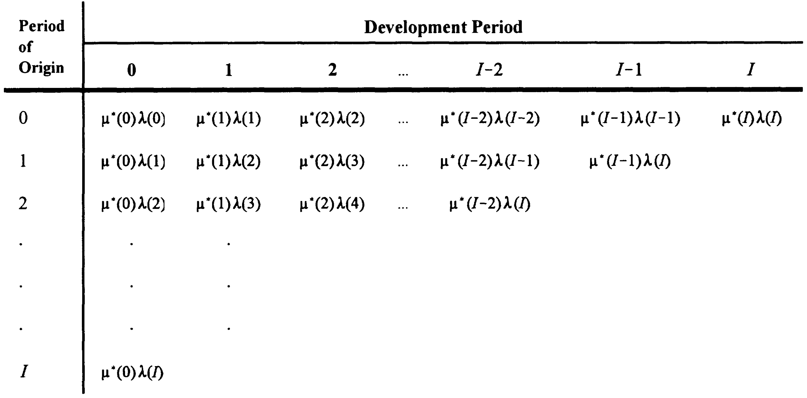
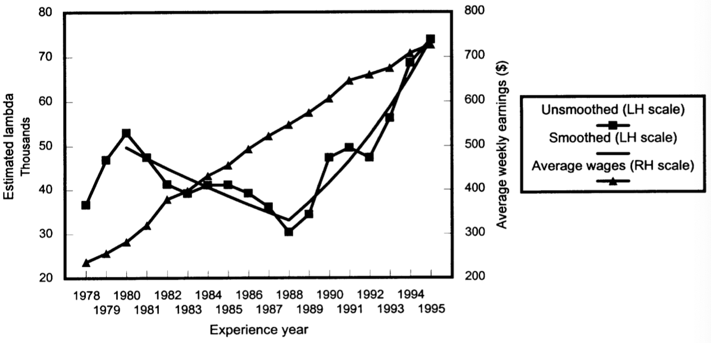

 
```{r setup, include=FALSE}
library(knitr)

### Change these two variables to change name of image folder and output file
#
graphics_folder <- "module-4"
output_name <- "23-Top-M4-lec" # change latest slides below, too!

### Do not change the following unless you know what you are doing
# output width
options(width = 70)
source(sprintf("%s/static/slide-setup.R", rprojroot::find_root(".Rprofile")))
graphics_path <-  sprintf("/img/%s", graphics_folder)    # Directory of where files are kept for this page

if (exists("output_type") && output_type == "beamer") {
  graphics_path <-  sprintf("%s/static/img/%s", root_dir, graphics_folder)    # Directory of where files are kept for this page
}
```

```{r, eval=F, include=F}
# Run this chunk to export to pdf
# Make sure that the setup chunk is run first
#  (to set graphics_folder and output_name)
#
#  The file is also saved before running this file
output_type <- "beamer" 

# install.packages("rprojroot")
root_dir <- rprojroot::find_root(".Rprofile")                               # Directory of Project
output_dir <- sprintf("%s/static/output", root_dir)                         # Directory of output pdfs
curr_file <- sprintf("%s/index.Rmd", getwd())
### Use this and run the lines from graphics_folder to render() to create pdf
rmarkdown::render(input = curr_file, output_file = output_name, output_dir = output_dir)

### Other notes to self
#The first 4 lines.
#```{r test, output.lines=4}
#```
#Remove the first 8 lines.
#```{r test, output.lines=-(1:8)}
#```
#From 8 to 15.
#```{r test, output.lines=8:15}
#```

# install.packages("formatR")
# collapse=TRUE #for collapsing output with code
```

```{r, include=FALSE}
library(astsa)
library(xts)
library(readxl)
library(writexl)
library(stats)
library(actuar)
library(fitdistrplus)
library(tidyverse)
library(evir)
library(extRemes)
```


[^1]: References: Chapter 3 of @Tay00 | $\; \rightarrow$  [\textcolor{blue}{\underline{latest slides}}](https://gim-am3.netlify.app/output/23-Top-M4-lec.pdf) 

# Case estimation (3.1) 

## Case estimates: Definition

- When a claim is notified, the insurer's employee who manages the claim (the "claims adjuster") typically formulates an estimate of the (remaining) cost of the claim and records it in the system.
- This estimate is typically adjusted over time as payments are made and additional information becomes available.
- These is called a "**case estimate**" (equivalently, "individual estimate", "manual estimate", "physical estimate").
- This is contrast to an "**aggregate estimate**", which would be inferred from past data, and some sort of statistical (reserving) procedure.

## Two approaches

You can think of the evolution of a claim costs as two parallel paths; consider those two examples (Figure 2 of @AvTaWa23):

```{r fig.align='center',out.width="100%", echo=F}
include_graphics("claim_history.png")
```


---

- Contrary to the evolution of aggregate payments (which lead to the "aggregate estimate"), "incurred" estimates are meant to be centered around the expected ultimate cost from the start. Remember they are defined as
$$I(i,j) = D(i,j) + Q(i,j),$$
where $D(i,j)$ are cumulative payments up to time $j$, and $Q(i,j)$ is the case estimate at that same time.
- The "good" thing about case estimates is that they are specific to the claim, and are an educated, intelligent guess of the cost of them, rather than a cold, myopic statistical estimate.
- The "bad" thing is that they are very subjective, and are subject to (potentially dangerous) systematic biases.

So which one should you use?

## Proposition 3.1

Quote from @Tay00:

(1) When outstanding loss liability is to be estimated in respect of a **large number of claims**, an **aggregate estimate** will usually exhibit performance, as measured by the relative error, superior to that of case estimates. 
(2) When the liability is to be estimated in respect of a **small number of claims**, superior performance will usually be exhibited by **case estimates corrected for bias**."

This is discussed/applied in Section 4.4 of @Tay00 (outside scope).

# Chain ladder (3.2)

## Introduction

- We used chain ladder for claim counts in Module 3.
- We can use it for forecasting other variables $Y(i,\cdot)$ which can be expressed in the cross-classified structure (i.e. $i\times j$ ) in much the same way, from a triangle of aggregate quantities 
$$Y(i,j) = \sum_{m=0}^j X(i,m),$$
where $X(i,j)$ are observed (incremental) quantities in cell $(i,j)$.
- Assumptions of proportionality can be made in much the same way, and the method applies in much the same way.
- Note that you can apply this on either paid or incurred losses (that is, $X$ would be either paid losses or incurred losses), as discussed in the following two subsections.
- Applications are quite wide and apply in a range of contexts and  
fields!


## Chain ladder on paid losses

### Unadjusted chain ladder

- We focus on paid losses, that is,
$$ X(i,j) = C(i,j).$$ 
- Hence $\hat{Y}(i,j)$ will yield estimates of future loss payments in future cells $(i,j)$.
- Everything else is the same as before.


### Example 

- See the spreadsheet [`Chapter3.xlsx`](https://canvas.lms.unimelb.edu.au/courses/191080/modules/items/5080918) for details of the calculations. The first tab sets out payment data corresponding to the example we studied in Module 3.
- Table 3.1-3.3 demonstrate how chain ladder can be used on payment data, in absence of inflation adjusment.

### Inflation adjusted chain ladder

- We are now dealing with payment data, which is typically distorted by inflation. This cannot be ignored.
- Not adjusting the data corresponds to making a rather strong assumption about inflation, as explained below.
- Remember that the asterisk $*$ denoted claims data brought back/forward to some reference date, and that the quantities without $*$ were nominal amounts.

---

- Assuming the multiplicative structure of the chain ladder model, if
$$ E\left[ C^*(i,j) \right] = \alpha^*(i) \mu^*(j)$$
then we have the "**inflation adjusted**" chain ladder model
$$ E\left[ C(i,j) \right] = \alpha^*(i) \mu^*(j) \frac{\lambda(k)}{\lambda_0},$$
which is to be compared with the "**unadjusted**" chain ladder model
$$ E\left[ C(i,j) \right] = \alpha(i) \mu(j).$$
- Note that Tables 3.1-3.3 corresponded to the "unadjusted" version.

---

Proposition of @Tay00:

*If $\alpha(\cdot)$, $\mu(\cdot)$ are not restricted, then the inflation adjusted and unadjusted chain ladder models are consistent* **if an only if** *the rate of claims inflation is constant over the whole experience.*

The last sentence means that we require
$$\frac{\lambda(k)}{\lambda(k-1)}\text{ to be constant for all }k>1.$$

---

Theorem 3.3 of @Tay00 implies that when claims inflation is constant at rate $f$,
$$\begin{aligned}
\alpha(i) &= \frac{\lambda(0)}{K\lambda_0} \alpha^*(i) (1+f)^i, \\
\mu(j) &= K\mu^*(j) (1+f)^j, \text{ with}
\end{aligned}$$
Note 

- One can choose $K=1$ or such that $\sum_j \mu^*(j) = 1.$ (this will generally not be the case). In the example below we have $K=1$.
- If all payments are brought to the date of the diagonal, then the adjustment $\lambda(0)/\lambda_0$ would typically just be an adjustment due to the fact that payments are not all made on the first or last day of the periods (typically, we assume in the middle on average). 


---

Proposition 3.4 of @Tay00 states that "Similar estimates of outstanding loss liability will be produced by:

(1) the unadjusted chain ladder;
(2) the inflation adjusted chain ladder, with a future inflation rate roughly equal to the average over the period of claims experience on which the estimates are based."

Note:

- This is because the unadjusted chain ladder age to age factors include  inflation implicitly, and that these are hence similarly projected in the future.
- If inflation was very heterogeneous in the past $I$ periods, and/or if it is assumed to be inconsistent with future inflation, an inflation adjusted chain ladder will lead to better forecasts (although it will require assumptions to be made about future inflation). See also Corollary 3.5 in @Tay00.
- Results hold by analogy in presence of superimposed inflation.

### Example 

- See the spreadsheet [`Chapter3.xlsx`](https://canvas.lms.unimelb.edu.au/courses/191080/modules/items/5080918) for details of the calculations.
- Table 3.4 displays $C^*(i,j)$ as of 31 December 1995 using the inflation index set of Appendix B.2. 
  - Note the accumulation factor of 1995 is not 1; it likely reflects the fact that payments in cells $k=1995$ were spread throughout 1995, so some adjustment is required to bring them to 31 December.
- Table 3.5 determines age to age factors, which we analyse from the point a view of the discussion above before proceeding to projections.

---

- Table 3.6 compares $\widehat{\mu}^*(j)$ of Table 3.5 with $\widehat{\mu}(j)$ of Table 3.1. 
- It is a consequence of Theorem 3.3 that 
$$f = \left(\frac{\mu(j)}{\mu^*(j)}\right)^{1/j}-1$$
and hence we can derive an "implied" rate $f_j$ for each period $j$:
$$f_j = \left(\frac{\widehat{\mu}(j)}{\widehat{\mu}^*(j)}\right)^{1/j}-1$$
- This is also in Table 3.6, and is informative of the evolution of claims inflation over 1978-1995. The weighted average uses $\widehat{\mu}^*(j)$ as weights.
- It is now clear how inflation distorted the evolution of claim payments, making them look longer tailed than they would otherwise have been.

---

- It is important to note that the results of Table 3.6 were influenced by our choice of age to age factors:
  - the "All" averaged factors over years 1978-1995
  - the "Last 6" over years 1989-1995
  - the "Last 3" over 1992-1995
- The average inflation rate over those years in Appendix B.2 was 6.8%, 4%, and 3.3% respectively (see calculations in spreadsheet).
- This illustrates Theorem 3.3.

---

- Now, Tables 3.7 and 3.8 forecast paid losses in 31/12/1995 dollar values
  - Note the forecast of \$374.8mio is evidently lower than the \$428.4mio forecast of the unadjusted chain ladder, as the latter implicitly allowed for inflation, and the former not.
- Table 3.9 lifts those forecasts to allow for future inflation
  - Note the half year adjustment $\lambda(0)/\lambda_0$ required for payment in the middle of the year on average.
  - Using 3.6% for future inflation leads to a forecast of \$421.1mio, which is very close to the unadjusted chain ladder forecast. This illustrates Proposition 3.4.

## Chain ladder on incurred losses

### Introduction

- Here we will produce a triangle of incurred losses, as an indicator of how our estimates typically evolve over time, and converge to ultimate:
  - the "aggregate" equivalent will be the incurred losses
  - the "incremental" equivalent are **adjustments** to incurred losses
- Note that this means that age-to-age factors of incurred losses generally won't be $>1$ since the incurred loss process is *not* a mostly nondecreasing process any more; this is illustrated in the two examples of claim developments earlier..  
(Aggregate payments were generally nondecreasing, even though there can be negative payments sometimes.)


### Example

- See the spreadsheet [`Chapter3.xlsx`](https://canvas.lms.unimelb.edu.au/courses/191080/modules/items/5080918) for details of the calculations.
- Table 3.10 displays incurred losses $I(i,j)$ (the "cumulative" data), which is decomposed in the next table (not in book) into $\Delta I(i,j)$ (the "incremental" data) - the heat map on that triangle illustrates the generally increasing, then decreasing nature of aggregate incurred losses.
- Table 3.11 age to age factors on the cumulative data. 
- Note that the factors are no longer all $>1$, which requires a new smoothing method, namely here a 3-period moving average; see (3.61) in @Tay00.
- Finally, Table 3.12 implements the chosen age to age factors into outstanding liabilities.

## Commentary

- The difference between $I(i,\infty)$ and $I(i,j)$ can be decomposed into:
  - an **IBNR** component (due to unreported claims);
  - an **IBNER** component ("Incurred But Not Enough Reported"), due to future revisions (inaccuracy) of case estimates.
- Tables 3.3 and 3.12 are very different (see comparison under Table 3.12)
  - Paid CL is much higher than Incurred CL for 1986 and later.
  - This is due to using last-3-year averages, where payments were heavier than before.
  - The leverage on immature years is illustrated with the age-to-ultimate factors in gray in tab "Table 3.1". Using all-year averages would reduce liability by 34-39% for the three most immature years.
  - A natural question would then be: are those changes permanent?


# Separation method (3.3)

## Main rationale

- A choice of inflation rate can be controversial, especially if it is significant or erratic. Unfortunately, this is also when it is the most impactful...
- In that context, the unadjusted chain ladder is unreliable, and the adjusted one will lead to conflict.
- Can we "let the data speak for themselves"?

A simple answer is the separation method.

- Here we keep the multiplicative structure we are familiar with.
- However, the genious idea is to use indices $i$ and $k$ instead of $i$ and $j$. 
- As a result, the $k$ factors will give a sense of calendar period effects (to which inflation belongs), and we will retain nice ease of interpretation of the parameters.

## Model

### Algebraic structure

- We assume
$$E[C(i,j)] = N(i) \mu^*(j) \lambda(k),$$
but now $\lambda(k)$ will be inferred from the triangle.
- Hence dividing $C(i,j)$ by $N(i)$ will yield the following algebraic structure of the separation model (Figure 3.1 in @Tay00):

```{r fig.align='center',out.width="75%", echo=F}

```


### Interpretation

- If we assume (wlog)
$$ \sum_{j=0}^\infty \mu^*(j) = 1,$$
then
$$\sum_{j=0}^\infty E\left[ \frac{C(i,j)}{N(i)}\right] = \sum_{j=0}^\infty \mu^*(j) \lambda(k) = \lambda(k).$$
- This is the average size of claims from period of origin $i$

**Proposition 3.6 (@Tay00)**: In the separation model as above, $\lambda(k)$ denotes the average size of claims which would occur if costs were the same in all experience periods as in period $k$.

## Estimation

@Tay00 derives estimators:
$$\begin{aligned}
\hat{\mu}^*(j) &=
\frac{\sum_{i=0}^{I-j} C(i,j)/\hat{N}(i)}{\sum_{k=j}^I \hat{\lambda}(k)} \\
&= \frac{\text{row sum of payments per claim}}{\text{diagonal sum of }\lambda\text{'s from }j\text{ to }I} \\
\hat{\lambda}^*(k) &=
\frac{\sum_{i=0}^{k} C(i,k-i)/\hat{N}(i)}{1-\sum_{j=k+1}^\infty \hat{\mu}^*(j)} \\
&= \frac{\text{diagonal sum of payments per claim for calendar period } k}{\text{proportion of claims paid after }k\text{ development periods}}
\end{aligned}$$

- This cannot be implemented directly
- Furthermore, we do not have the $\hat{\mu}^*(j)$ beyond $I$.

---

Define:

$$v^*(j) = \frac{\mu^*(j)}{\sum_{m=0}^I \mu^*(m)}, \quad \kappa(k) = \lambda(k)\sum_{m=0}^I \mu^*(m).$$ 

Note that $v^*(j)$ still is a proportion of a "period of origin" paid losses, but the base runs only up to development period $I$.

---

The following clever manipulation, which rewrites the model as a function of the (column) $v^*(j)$ and (diagonal) $\kappa(k)$ allows us to use the triangle easily for estimation. We have 
$$v^*(j)\kappa(k) = \mu^*(j)\lambda(k) = E\left[\frac{C(i,j)}{N(i)}\right] \text{ with } \sum_{j=0}^I v^*(j)=1.$$ 
Substitution in the estimators written above yields
$$\hat{v}^*(j) = \frac{\displaystyle
\sum_{i=0}^{I-j}\frac{C(i,j)}{\hat{N}(i)}
}{
\sum_{k=j}^I\hat{\kappa}(k)
} = \frac{\text{sum of triangle column }j}{\sum_{k=j}^I\hat{\kappa}(k)}$$
and 
$$ \hat{\kappa}(k) = \frac{\displaystyle
\sum_{i=0}^{k}\frac{C(i,j)}{\hat{N}(i)}
}{
1-\sum_{j=k+1}^I\hat{v}^*(j)
} = \frac{\text{sum of triangle diagonal }k}{1-\sum_{j=k+1}^I\hat{v}^*(j)}$$
which can be calculated sequentially 
$$\hat{\kappa}(I),\hat{v}^*(I),\hat{\kappa}(I-1),\ldots,\hat{v}^*(0).$$
 

 
## Example

- See the spreadsheet [`Chapter3.xlsx`](https://canvas.lms.unimelb.edu.au/courses/191080/modules/items/5080918) for details of the calculations.
- Table 3.13 starts by computing the $C(i,j)/N(i)$, where $N(i)$ comes from Table 2.4. It also displays diagonal and column sums.
- Those sums are used in Table 3.14 to calculate the $\hat{\kappa}(k)$ and $v^*(j)$ in the sequential way described above.

---

- The estimates above can be translated into corresponding $\lambda(k)$'s in that the $\kappa$ are proportional (see (3.73)).
- These were the "inflation" equivalent we were trying to get from the model ("let the data speak"); see Figure 3.2 of @Tay00:

```{r fig.align='center',out.width="75%", echo=F}

```

- This suggests negative claims inflation up to 1988 (-4.9%), and strongly positive afterwards (12.1%).
- The ensuing $v^*(j)$ are very different from that stemming from  
the inflation adjusted chain ladder; see Table 3.15.


---

- Table 3.16 calculates model paid losses for past *and* future. 
- The $\hat{\kappa}(k)$ for $k>I$ need to be projected. We use 
$$ \hat{\kappa}(k) = \hat{\kappa}(1995) \cdot (1.075)^{k-1995}.$$
- Population of the table needs care because the $\hat{\kappa}(k)$ factors (including with projection) apply diagonally.
- Comparison of model and actual paid losses to date is interesting:
  - By construction, column and diagonal sums should be identical, or very close.
  - The row sums, however, have no guarantee of matching. These are the paid losses to date, per period of origin. Examination of actual vs model such aggregate losses is a good indication of model fit.
  - We can also do this cell by cell with a heat map (done below, not in the book).
  - It turns out that those sums are matching relatively well, with a slight tendency to underestimate in early years, and to overestimate in later years.

## Commentary

- The interpretation of $\lambda(k)$ requires care, as it is a "catch all" indicator.
- For instance, a change of speed of payment / notification across calendar years would be caught (would distort) by $\lambda(k)$.

# The average payments per claim incurred (PPCI) method

## Main rationale

- Assume you have data on aggregate payments and claim counts.
- One can then try to project counts, and payments per claim separately.
- The product can then be used as an estimate for ultimate.
- One need to be careful to have consistent claims severity and frequency data, typically:
  - If paid (fully) claims, match to finalised claims.
  - If claims incurred, match to reported claims.
- The former leads to the PPCF, the latter to the PPCI. We focus on the latter.
- One major advantage is in the flexibility offered by the method to include superimposed inflation (this is illustrated in @Tay00, but is outside scope here).

## Process

- Project incurred claim counts as per Chapter 2 (frequency).
- Work out average payments per claim (severity) incurred in a triangle:
  - These will evolve over time.
  - We can analyse this evolution in a "chain ladder" type way.
- The method rests on the assumption that this evolution is sufficiently regular that we can use it to "develop" our latest value of incurred claim cost (in the diagonal) into a final "payments per claim incurred", to be multiplied by our projected total number of claim incurred.

## Example

- See the spreadsheet [`PPCI.xlsx`](https://canvas.lms.unimelb.edu.au/courses/191080/modules/items/5080919) for details of the calculations, which are based on the data of @Tay00, but do not follow the (more complicated) calculations of Chapter 4.
- Start from Table 3.10 of incurred losses, and incurred claims counts from Table 2.2. We need to transform the latter into cumulative form, so we can have both of same nature (cumulative).
- The result of the division is an average payment per claim incurred: 
  - Analysis of age to age actors shows that recent years are different, especially for later years.
  - The age-to-ultimate factors are those used to "develop" the latest average PPCI, into an ultimate one.
- In the end, forecast outstanding liabilities are not dissimilar to those obtained form the incurred CL, although a little higher, perhaps due to slightly more responsiveness to the recent changes in claim development.

---

A comparison and recap of all methods seen in this module is provided at the bottom.

\vspace{2cm}

**Which one would you choose?**


# References {.allowframebreaks}
