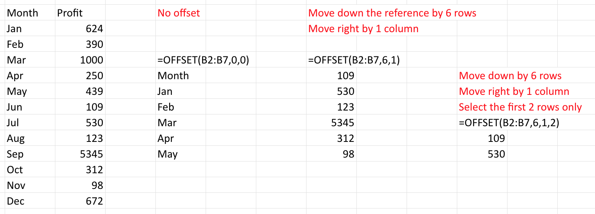
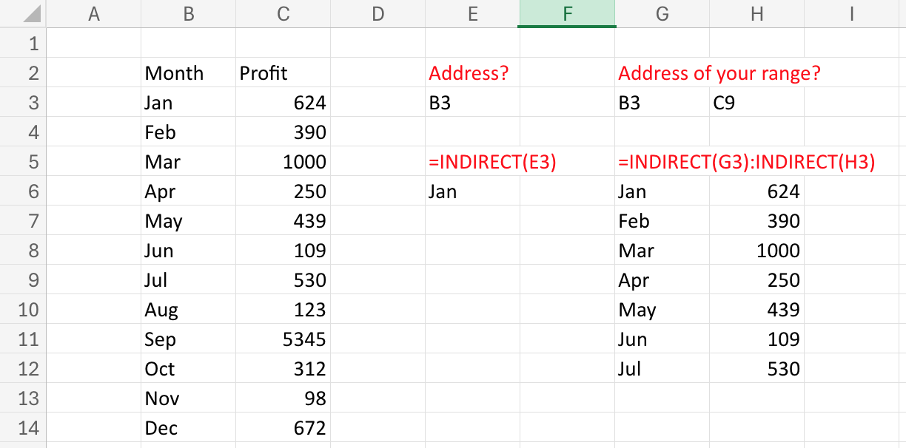
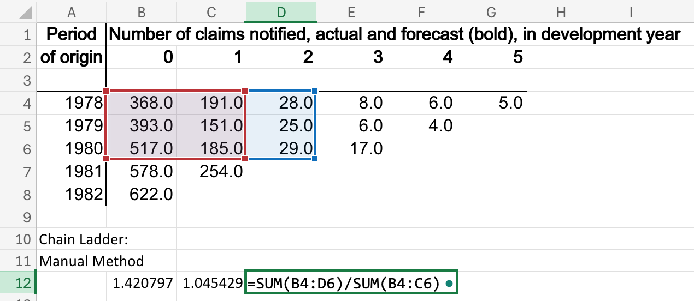
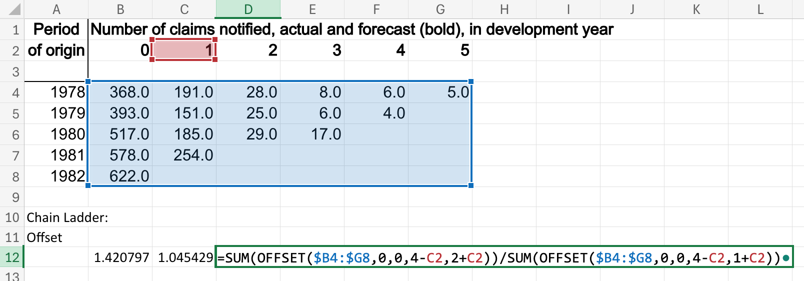
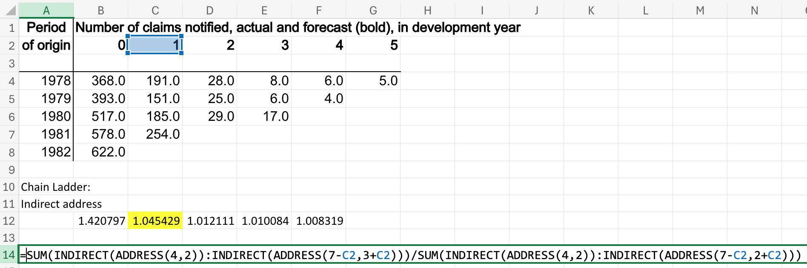

# Introduction and Assumed Knowledge

## Why Excel?

- Excel is great to spread data and calculations in a tabular form, and have a visual overview.
- Most financial modelling is done in Excel (at least initially).
- In actuarial work, many more advanced codes (in R, Python, C++, C#, VBA, …) often starts with someone playing around in Excel, and once proof of concept is approved, this moves to proper coding.
- It is assessed in CM2-B (!).

## Issues with Excel

Excel is notoriously problematic in certain areas:

- Lack of transparency - one can’t see the formulas unless you click in a cell; alternatively, you can’t see the formulas and understand where the numbers come from unless you are in Excel (a problem for reports, presentations etc).
- Mistakes can be tiny but have huge consequences in the end (the job of Excel auditor actually exists!).
- Lack of good documentation capability (as opposed to code); this makes collaboration and audit difficult, and creates an operational risk (e.g. builder leaves).

------------------------------------------------------------------------

- Lack of rigour in the construction of a model (input, assumptions, intermediary calculations, output).
- Can’t handle (seriously) large data sets.
- Lack of good and flexible data cleaning and manipulation capabilities.
- Sometimes code is a lot easier (e.g. flip a vector around, sum over a diagonal, …).

I know there are counter arguments for all of those, but this presupposes you know what the solutions are. You’ll learn some of those here!

## Assumed knowledge

See [`prerequisite knowledge on the website`](https://topics-actl.netlify.app/docs/0-prerequisite-knowledge/). Some extracts:

- Autofill: Chapter 3, p. 105-116, and p. 298-301
- Named ranges and constants: Chapter 7, page 312-332
- Absolute and mixed cell references (\$): Chapter 7, pages 332-342
- New Excel 2019 functions (IFS, MAXIFS, MINIFS): Chapter 8, pages 381-398
- Formula Auditing: Chapter 9, p. 436-439
- Paste special (incl, e.g. `Transpose`): Chapter 11, pages 518-530

Page references are for Slager and Slager (2020), see [`link here`](https://link.springer.com/book/10.1007/978-1-4842-6209-2).

Also, see tab `Assumed Knowledge` in the [`module 6 spreadsheet`](https://canvas.lms.unimelb.edu.au/courses/191080/modules/items/5091456).

## Some keyboard shortcuts

There are many keyboard shortcuts that can help you work with Excel efficiently. Some (but not all) useful shortcuts are:

- F4: Cycles through combinations of absolute and relative references
- ctrl + shift + arrow key: Extend the selection of cells to the last non-blank cell towards the specified direction
- ctrl + PageDown/PageUp: Move to the next/previous sheet
- shift + F11: Insert new worksheet

See [Microsoft - `Keyboard shortcuts in Excel`](https://support.microsoft.com/en-au/office/keyboard-shortcuts-in-excel-1798d9d5-842a-42b8-9c99-9b7213f0040f) for list of all keyboard shortcuts.

# Data Wrangling and Exploratory Data Analysis

## Data Wrangling

- Sometimes we need to work on data from an external source.
- The data could be messy to work with.
  - There could be non-printable characters such as tabs (`\t`), new lines (`\n`) in the original data.
    - Check [`List of ASCII values`](https://www.ibm.com/docs/en/aix/7.2?topic=adapters-ascii-decimal-hexadecimal-octal-binary-conversion-table) for ASCII codes for non-printable characters.
  - We may want to process the strings to retrieve information.
  - Data formats are inconsistent.
- It is important to clean our data before analysis!

### Some data cleaning steps

- Editing Texts
  - `CLEAN()`, `TRIM()`, and `SUBSTITUTE()` to deal with any non-printable characters.
  - Merging and splitting columns with functions like `LEFT()`, `RIGHT()` and `MID()` and `SEARCH()`. Wildcard characters `?` and `*` are also useful.
- Removing duplicate rows: `Data → Data Tools → Remove Duplicates`.
- Converting table into “machine-readable” formats.
  - An example in Chapter 1, P.2-9 in Kolokolov (2023).
  - Macros would be useful here!
- There are much more functions and steps can be used to clean your data - see [`Microsoft - Top ten ways to clean your data`](https://support.microsoft.com/en-au/office/top-ten-ways-to-clean-your-data-2844b620-677c-47a7-ac3e-c2e157d1db19).

## Pivot tables

- Pivot tables are often considered as very difficult to master, but they are not that difficult to start with.
- Example (in [`module 6 spreadsheet`](https://canvas.lms.unimelb.edu.au/courses/191080/modules/items/5091456)): FIFA WWC
  - Insert / Pivot Table.
  - See how you can use variables as filters, rows, or columns. Move them around.
  - See how columns can display other things than `Sum`, such as `Count`, `Average`, `Max`, `Min`, or `Product`
- Note there are recommended Pivot Tables (automated recommendation within Excel); in the case of FIFA WWC it is not very helpful.
- Reference: Chapter 15 of Slager and Slager (2020).

## Pivot charts

- A pivot chart can be created from the Pivot Table but also directly from the data.
- A major difference with start charts is that you it will be somewhat “interactive” - there will be buttons you can use to alter the chart.
- Example (in [`module 6 spreadsheet`](https://canvas.lms.unimelb.edu.au/courses/191080/modules/items/5091456)): FIFA WWC
  - Insert / Pivot Chart;
  - In the example I changed the style of graph to “Combo” to allow for the two different scales;
  - I also included a “slicer” (click on chart / insert slicer), in order to easily filter by squad.
- Reference: Chapter 15 of Slager and Slager (2020).

# Dynamic Arrays

## Spilling

- One advantage of programs like `R` are the easy use and manipulation of vectors.
- Excel can do similar things, and the vectors are called arrays. This is new (post Office 365), and is a bit of a game changer.
- Before Office 365, Excel was incapable of depositing results beyond just 1 cell. This is called “spilling”.
- Note Excell will need the required space to spill.
- Main reference is Katz (2023) - we’ll only introduce this here.

### Example

- Here we introduce array formulas.
  - If you calculate the sum of an array you’ll get a single number.
  - The result of an array formula (such as `LEN()`), when you input an array, will give you an array.
- See [`module 6 spreadsheet`](https://canvas.lms.unimelb.edu.au/courses/191080/modules/items/5091456):
  - `LEN()` gives an array.
  - You could then get the sum without having to put the array anywhere: `SUM(LEN(B3:B6))`.
  - Note that when I wrote the above, it became `SUM(LEN(B3#))` automatically - more on that later.
- `SUM(LEN(B3:B6))` will work in any version of Excel because it requires only one cell to output, but not `LEN(B3:B6)` as it requires several cells (“spilling”).
- Note you can spill named ranges, too!

## Think in vectors

- Once you understand you can create vectors and either display or manipulate them, Excel becomes a lot more powerful.
- You can also use arrays in arguments of known formulas such as `VLOOKUP()`,
  - For instance `VLOOKUP(.,.,{2,5})` will return value from the 2nd and 5th columns row-wise.
  - If you use `VLOOKUP(.,.,{2;5})` (with the semicolon) they will display columnwise.
  - See examples in [`module 6 spreadsheet`](https://canvas.lms.unimelb.edu.au/courses/191080/modules/items/5091456).

## The `#` sign

- The `#` sign when added to a reference to a cell where a dynamic array is written will duplicate that array (and spilled results).
- It is shorter, but also it will dynamically change the size of the array
  - This can be desired or not.
  - See example in [`module 6 spreadsheet`](https://canvas.lms.unimelb.edu.au/courses/191080/modules/items/5091456).

## New formulas

- There are a number of new formulas which were available in coding languages like `R` for a long time, which can be useful, and which are now available in Excel
  - for instance `SEQUENCE()`, `UNIQUE()`, `FILTER()`, `RANDARRAY()`…
- Some of those are exemplifed in [`module 6 spreadsheet`](https://canvas.lms.unimelb.edu.au/courses/191080/modules/items/5091456).
- You are encouraged to browse through. They really bring data handling in Excel a little closer to coded languages such as `R`.

## Lookup functions

- Lookup functions are essential for Excel users.
- Useful when you need to search within a single row or column to find a corresponding value in the same position in a second row or column.
- Multiple lookup functions are available.
- All of them works with arrays of lookup values!

### `VLOOKUP()`

- Available for all versions of Excel, so it is reliable when sharing
  spreadsheets.
- Some drawbacks of `VLOOKUP()`:
  - Lookup Column Must Be the First Column
  - Can be confusing when specifying the return column
- `HLOOKUP()` is the horizontal version of `VLOOKUP()`.
- Check [`this video`](https://support.microsoft.com/en-au/office/video-vlookup-when-and-how-to-use-it-9a86157a-5542-4148-a536-724823014785) to see how it works.

### `XLOOKUP()`

- An upgraded version for `VLOOKUP()` released in 2020 - not available in Excel 2016 and Excel 2019.
  - Robust lookup function: You can search any direction.
  - Can return multiple arrays as well.
  - The lookup array does not have to be the first column/row.
  - Different search modes available: from first to last, last to first, etc.
  - An `if not found` argument to allow combinations with functions like `IFERROR`, `IFNA`.
- Watch [`this video`](https://support.microsoft.com/en-au/office/xlookup-function-b7fd680e-6d10-43e6-84f9-88eae8bf5929) to see how it works.

### `MATCH()`, `XMATCH()`

- Both functions work similarly by finding the index of your lookup value within the lookup array.
- `XMATCH()` is more robust by providing new match mode and search mode.
- By combining with `INDEX()`, it returns the value instead of the index inside the lookup array.

Check [`module 6 spreadsheet`](https://canvas.lms.unimelb.edu.au/courses/191080/modules/items/5091456) for comparisons between these lookup functions.

Reference: Chapter 7 and 11 of Murray (2022)

# Dynamic references

- Sometimes we have to work with references that changes position or size over time.
- For instance, we need to adjust our range of references for each development period when modelling the development effects.
- This is tedious to do manually if we have a large dataset!
- Dynamic Referencing will be useful here.

## Some functions for dynamic referencing

### `OFFSET()`

- Allows you to move your initial references to any direction by any number of cells.
- You can select the height and width of the returned range.

### `INDIRECT()`

- Goes to the address specified by the reference text you entered.
  - e.g. `INDIRECT(B2)` goes to the cell `A2` if cell `B2` contains the text `"A2"`.
- Your reference text can be a table, a named range, etc.

### `ADDRESS()`

- Gives you the address of your specified columns and rows.
- For instance, you will get `A1` if you type in the formula `ADDRESS(1,1)`.
- The first argument specifies the row, and the second argument specifies the column.
- This allows you to obtain dynamic addresses by changing your specified columns and rows based on some index columns/rows.
- By combining with `INDIRECT()`, you can retrieve the data contained in your dynamic range.

### Some drawbacks

- Both `OFFSET()` and `INDIRECT()` are volatile functions.
- Volatile functions are functions in which the value can change even if none of the function’s arguments change.
- Excel recalculates them even if you changed a cell without these functions!
- Can be computationally inefficient if the spreadsheet relies on them heavily.

See `reference` tab in [`module 6 spreadsheet`](https://canvas.lms.unimelb.edu.au/courses/191080/modules/items/5091456) for demonstrations.

## How to use them for triangles?

### Manual method

- This method requires you to change your reference ranges manually each development period.

### Offset method

1. First select the whole triangle (`OFFSET($B4:$G8,0,0)`).
2. Select the range for summation using offset (The last two arguments in `OFFSET`).
3. As development period increase, dynamically change the references by editing the height and width of the offset using the development period.

### Indirect Address method

1. Select the top left corner of the triangle first (`INDIRECT(ADDRESS(4,2))`).
2. Dynamically change the reference by editing the location of bottom right corner of the reference (`INDIRECT(ADDRESS(7-C2, 3+C2)))`).

Reference: Chapter 11 of Murray (2022)

# General etiquette, auditing, and tools

## Etiquette

You should build your spreadsheet with (at least) the following **objectives** in mind:

1.  so as to minimise chances or error (accuracy);
2.  so as to minimise unnecessary calculations (efficiency);
3.  so as to make the structure as clear as possible (transparency);
4.  so as to make updates, changes and extensions possible and easy (extendibility);
5.  so as to allow someone else to use it easily (user friendliness);
6.  so as to allow someone else to verify it easily (auditability).

Those are, of course, interconnected. We could add more (for instance, automation of data input via an API, automation of communication objects such as charts, etc…).

## Principles

There is no single way to achieve the objectives above, but there are a number of **principles** that one could list, and that will contribute to meeting those objectives:

- Have a separate tab that collects all your assumptions that are valid for the whole spreadsheet (1, 3, 4, 5, 6).
  - Include some explanations about the source/justification of those assumptions.
  - Give your assumptions names (for instance, the technical rate of interest to calculate life insurance could be called `techint` or similar, for ease of later reference, and to make formulas more easily readable).
- Also include your data sets in separate tabs (1, 3, 4, 5, 6).
  - Name your data (including columns and/or rows if possible; e.g. `FIFA WWC` in the spreadsheet; see also “Named ranges and constants”: Chapter 7, page 312-332).

------------------------------------------------------------------------

- Consider colouring / contouring input and output differently (3, 5)
  - This is not always advisable, but if you have a large model with relatively few input (e.g. purchase price and interest rate for a property mortgage schedule) and/or few outputs (e.g. NPV) then this achieves many of the objectives.
- Use named ranges and variables as much as possible (1, 3, 5, 6), unless the variable is going to be used only once.
- Use more advanced formulas if shorter, and avoid too much nesting (1, 3, 4, 5, 6).

## Tools for auditing

### Dependents and precendents

Use of dependents / precedents, e.g.:

1.  go to tab `Dependents - Precedents - PPCI`;
2.  click on one of the outstanding loss projected amounts;
3.  make sure the formula tool tab is live;
4.  click on the “trace precedents” sequentially.

This will highlight dependence of each cell to previous cells, sequentially, with arrows.

This is useful for

- understanding the structure of a spreadsheet;
- check formulas (audit);
- debug issues.

(Formula Auditing: Chapter 9, p. 436-439)

### Show formulas

- The “Formulas” tool tab should have a “Show formula” tile. This will replace all numeric values by formulas.
  - This is helpful to check what numbers are hard coded, and which are results of calculations. Together with dependents, it helps seeing if everything is as dynamic as it should.
- If you want a formula to be shown all the time start with an apostrophe `'`, and the formula will show as text.

(Formula Auditing: Chapter 9, p. 436-439)

# Simulation, Macros and VBA

## Simulation

### Why simulation?

- Suppose we have some model with given inputs.
- Inputs can be uncertain.
  - Weather, arrival speed of claims, interest rates,…
- We want to derive the distributions of our output.
  - We want to know the statistical properties (e.g. mean, SD) of our output.
  - Sometimes it can be complicated to derive the distribution of the output explicitly.
- By simulating the uncertain inputs, we can generate random observations from our model.
  - These generations will result in an empirical distribution of the output.
  - We can then use this distribution to estimate moments, quantiles, ranges, and probabilities.
- Simulation is widely used in the work by actuaries.

### Generating random numbers 1

- `RAND()` generates random numbers from a uniform distribution on (0,1).
- `RANDARRAY()` can generate an array of random numbers with specified dimension.
  - You can specify the range of numbers.
  - You can also specify whether the generations are discrete or continuous.
- Excel recalculate these functions whenever there are changes in any cells.
- What if we want to generate numbers that are not uniformly distributed?

### Generating random numbers 2

- Inverse functions can be useful to generate numbers under different distributions.
  - Use `NORM.S.INV(RAND())` to generate numbers with standard normal distribution.
  - In general, to generate random numbers with specified distributions, we can apply their inverse functions to `RAND()`.
- Some inverse functions available in Excel:
  - `BETA.INV()` for Beta distribution
  - `LOGNORM.INV()` for lognormal distribution
- To see more inverse/probability functions in Excel, go to Formulas → More
  Functions → Statistical.

### Discrete random variables

- We can also simulate outcomes from discrete distributions.
- Suppose we have a random variable with three outcomes: `\(A\)` with `\(p=0.5\)`, `\(B\)` with `\(p=0.3\)`, and `\(C\)` with `\(p=0.2\)`.
- First, generate a random number `\(x\)` with `RAND()`.
  - If `\(x\leq 0.5\)`, the outcome is `\(A\)`.
  - If `\(0.5 < x \leq (0.5+0.3)=0.8\)`, the outcome is `\(B\)`
  - Otherwise, the outcome is `\(C\)`.
- Why does it work? Inverse transformation.
- More theoretical formulation in Module 9.

See [`module 6 spreadsheet`](https://canvas.lms.unimelb.edu.au/courses/191080/modules/items/5091456) for illustrations.

## Macros

### What is a macro?

- Sometimes we may need to do a set of actions or tasks repeatedly.
  - e.g. cleaning data, formatting cells, creating tables.
  - This is repetitive and very time-consuming to do cell-by-cell!
- A macro can store this set of actions and run whenever you need it.
  - You can also make minor edits to the recorded actions.

### Recording a macro

1.  A macro can be recorded by going to Developer tab → Record Macro.
    - To turn on the Developer tab, check [`Quick start: Create a macro`](https://support.microsoft.com/en-au/office/quick-start-create-a-macro-741130ca-080d-49f5-9471-1e5fb3d581a8#OfficeVersion=Mac)
2.  A dialog box will be opened. You can rename your macro and select a shortcut key for the macro.
3.  Click “OK” to create your macro. Excel will now start recording your actions.
4.  Click “Stop Recording” to save your macro.

- Note: You can select `Use Relative References` when recording a macro. In that way, you can run your macro relative to your currently selected cell, instead of a fixed range.

### Running a macro

- There are multiple ways to run your recorded macros.
- Running macros with your assigned shortcut.
- Running macros through the Developer tab.
  1.  Go to Developer → Macro. A list of your recorded macros should come up.
  2.  Click on the sheet and cells you want to run a macro with. Click “Run” to run it.
- Running macros with buttons.
  1.  Go to Developer → Form Controls → Insert → Button.
  2.  Click on the cell you want to insert the button, the Assign Macro box should come up.
  3.  Choose your macro and click “OK”. Now you can run your macro by clicking the button.
- There are more ways to run macros. See P.886-894 in Slager and Slager (2020).

## VBA

### What is VBA?

- VBA stands for Visual Basic for Applications.
- It is a programming language used by Excel (and all Microsoft Office apps).
- Your recorded macros are stored as VBA code.
- You can create your own macros by writing VBA code.
  - They can be assigned in the same way as a recorded one.
- VBA is needed as some actions such as conditioning and looping cannot be recorded.
- Excel writes bad VBA code from recorded macros.

### Editing your macros

- You can modify your recorded macros with Visual Basic Editor (VBE).
- Open VBE with `Alt + F8` or go to Developer → Code → Macros → select the macro you want to edit → Edit.
- Some minor edits you can make to your macros:
  - Switch between reference types.
  - Add/change different types of formatting.
  - Edit cell selections.

### Conditions

- By using conditions in our VBA code, we can run different actions according to the given condition, just like `IF` in Excel.
- But there’s more we can do with VBA!
- Some simple examples of conditioning:
  - Change cell colour based on cell value.
  - Display different message boxes based on the input to input box.
  - Display different texts in cells based on the value in your active cell.
- You can do nested if with if-else statements.
- Logical operators are also available for multiple conditions.
  - And, Or, Xor, Not

### Loops

- Useful when you want to automate iterative operations.
- There are two types of loops in VBA:
  - For loops are used when you know the number of iterations.
  - While loops are used when you want to stop based on some conditions.
  - Just a general rule. They are interchangeable.
- Some examples:
  - Format cells until reaching the end of a row/column.
  - Fill every `\(n\)` cell with some numbers.
  - Keep showing input boxes and do operations until entering specific input.

Reference: Chapter 2, 3 of Lee and Lee (2023)

# Next steps

- All of Katz (2023) is relevant, but take it as a cook book for the assignment. You can go as far as you wish.
- Chapters 16, 17, 18, and 19 of Slager and Slager (2020) are out of scope.
- However, macros and VBA (which is Chapter 19) are essential components of Excel
  - I strongly encourage you to get started. Start by recording a macro, then play around with the code.
  - VBA allows more efficient calculations via compiled code, and is a powerful addition to Excel.
- Some recent development in understanding spreadsheets with Large Language Models: [`SpreadsheetLLM: Encoding Spreadsheets for Large Language Models`](https://arxiv.org/abs/2407.09025).
- Fun fact: the 2021 [`Excel World Champion`](https://www.fmworldcup.com/excel-esports/microsoft-excel-world-championship/) is an actuary: Andrew Ngai, now Director at Taylor Fry.

# References

Katz, A. I. 2023. *Up up and Array! Dynamic Array Formulas for Excel 365 and Beyond*. Apress.

Kolokolov, Alex. 2023. *Make Your Data Speak: Creating Actionable Data Through Excel for Non-Technical Professionals*.

Lee, John, and Cheng-Few Lee. 2023. *Essentials of Excel VBA, Python, and r: Volume i: Financial Statistics and Portfolio Analysis*.

Murray, Alan. 2022. *Advanced Excel Formulas: Unleashing Brilliance with Excel Formulas*.

Slager, D., and A. Slager. 2020. *Essential Excel 2019*. 2nd ed. Apress.

[^1]: References: Slager and Slager (2020) and Katz (2023) \| `\(\; \rightarrow\)` 
